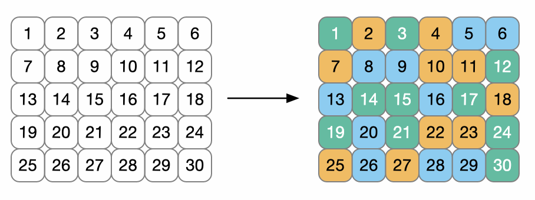
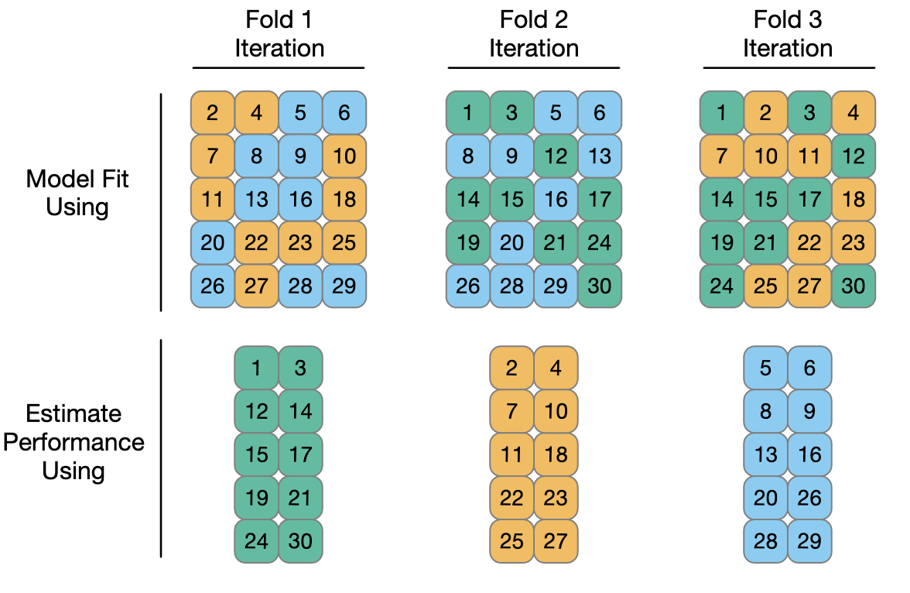

```{r setup, include=FALSE}
knitr::opts_chunk$set(echo = TRUE)
library(PPBDS.data)
library(stringr)
library(rstanarm)
library(tidyverse)
library(tidymodels)
library(fec16)
```

We have lots of choices to make when creating our models. How do we choose between these alternatives?

1. **Let your substantive knowledge / theory guide the way**: when deciding how to build a model, start with your knowledge of the topic. 
    - This is what you can learn from your substantive classes and real-world experience! 
    - How do you predict which presidential candidate an American will vote for? Knowing their political party, race, state, etc. would probably help.
2. **Evaluate and compare errors in your model predictions**: we can use our models to make predictions and then compare those predictions to an observed truth. 
    - We can compare errors from various models to see which one performs best.
    
**Today** we'll talk about:

1. What model prediction error is and how to calculate it.
2. Using `tidymodels` to evaluate models.
3. Testing / training split and cross-validation.
    
## Calculating Model Error

Let's start with a model. Do house candidates who perform well in primaries also perform well in general elections?

```{r}
## remove extremely noncompetitive races - maybe uncontested?

house <- results_house %>% 
  filter(primary_percent < 0.98 & 
           !is.na(primary_percent) & !is.na(general_percent))

fit_1 <- stan_glm(general_percent ~ primary_percent, 
         refresh = 0, data = house)

print(fit_1, digits = 4)
```

We can see the coefficient on `primary_percent` is large and positive. Makes sense.

But how accurate is the model? There are three steps to calculate error:

1. **Fit model**: already done!
2. **Make predictions with our model**: for now, we'll predict `general_percent` on the same data we used to fit the model (this will change soon!).
3. **Compare those predictions to the truth**: we can then compare those predictions to the actual observed `general_percent` values in our real dataset.

```{r}
## use our model predictions (i.e. not posterior draws)
predict(fit_1, newdata = house)[1:5]
# and here is the truth!
house$general_percent[1:5]

results <- tibble(truth = house$general_percent,
                  predictions = predict(fit_1, newdata = house))
head(results)
```

The plot points are our observed true values in the dataset.

For a given value of `primary_percent` (the x-axis), our model would predict a value of `general_percent` (the outcome) **on the model line**.

```{r}
ggplot(house, aes(x = primary_percent, y = general_percent)) + 
  geom_point() + 
  geom_abline(intercept = fit_1$coefficients["(Intercept)"],
              slope     = fit_1$coefficients["primary_percent"],
              col       = "dodgerblue", lwd = 1.5) + 
  theme_classic() + 
  labs(title = "Primary vs. General Election Performance",
       subtitle = "Model predictions (blue line) vs. observed values (points)",
       x = "Primary %", y = "General %")
```

We can think of the **error** as **the distance between the model's predicted outcome (line) and the truth (point)**.

```{r}
## Error!
ggplot(house, aes(x = primary_percent, 
                  y = general_percent,
                  color = cand_id == "H6TX08100")) + 
  geom_point() + 
  theme_classic() + 
  labs(title = "Primary vs. General Election Performance",
       subtitle = "Model predictions (blue line) vs. observed values (points)",
       x = "Primary %", y = "General %") + 
   geom_segment(x = 0.53425, y = 0.50, xend = 0.53425, yend = 1, 
                lty = "dashed", colour = "red", lwd = .5) + 
  geom_abline(intercept = fit_1$coefficients["(Intercept)"],
              slope     = fit_1$coefficients["primary_percent"],
              col       = "dodgerblue", lwd = 1.5) +
   theme(legend.position = "none") + 
   scale_color_manual(values = c("darkblue", "red"))
```

To come up with an estimate for how accurate our model is, we can summarize the difference between model predictions ($\hat{y}_i$)and truth ($y_i$) for every row ($i$) in the dataset.

**Root Mean Squared Error** is one common way to measure error. RMSE takes the difference between truth and prediction, squares it, takes an average, then the square root. 

For true outcome $y$ and predicted value $\hat{y}$, we can define RMSE as:

$$ \sqrt{\sum_{i=1}^N \frac{(y_i - \hat{y_i})^2}{N}}$$

That is:

- **Root**: from the square root.
- **Mean**: because we take a sum (with $\Sigma$) and then divide by N - this is an average!
- **Squared**: because the difference between $y$ and $\hat{y}$ is squared.
- **Error**: because all of this is a way of measuring the error.

Let's calculate RMSE:

```{r}
results %>%
  # mutate because we need a truth - prediction for every row
  mutate(sq_diff = (truth - predictions)^2) %>%
  # summarize because we're taking an average over all rows
  summarise(rmse = sqrt(mean(sq_diff)))
```

**Let's do this together in Scene 1.**

## Tidymodels

tidymodels is a more powerful way of doing these kinds of model selection measurements. We need a few different steps to create a tidymodel:

1. **Define a workflow and recipe:** this tells tidymodels what "recipe" to use. We've used "formulas" in our `stan_glm` models, these are the same thing - defining the outcome and predictors.
2. **Choose your model**: so far, we have used linear regression in Stan. This would be `add_model(linear_reg() %>% set_engine("stan"))`.
3. **Fit your model and calculate error**: just like above, now we can fit models (with `fit`), make predictions (with `predict`), and calculate error.

This is what you did in the Tutorial from Chapter 10. Let's do one together:

##### 1. Define workflow and recipe

```{r}
# 1. Define a workflow and recipe
model_workflow <- workflow() %>% 
  add_recipe(recipe(general_percent ~ primary_percent,
                    data = house)) 
```

If we had any dummy variables or interaction terms, we could have piped this recipe through to add them with functions like `step_dummy` or `step_interact`. 

For example, to add an interaction:

```{r, eval=FALSE}
# to add an interaction like primary_percent*incumbent
workflow() %>% 
  add_recipe(recipe(general_percent ~ primary_percent + incumbent,
                    data = house)) %>%
  step_interact(~ primary_percent*incumbent)
```
  
##### 2. Choose your model

We'll tell `tidymodels` we're using linear regression via Stan with the code below:

```{r}
model_chosen <- model_workflow %>%
  add_model(linear_reg() %>% set_engine("stan"))
```

You don't need to create separate objects for each step. You could define the recipe and model all at once:

```{r}
# you can do it all at once!
model_chosen <- workflow() %>% 
  add_recipe(recipe(general_percent ~ primary_percent + incumbent,
                    data = house)) %>%
  step_interact(~ primary_percent*incumbent) %>%
  add_model(linear_reg() %>% set_engine("stan"))
```

##### 3. Fit your model and calculate error

The `fit` and `predict` functions work just like before:

```{r}
fit_model <- model_chosen %>%
  fit(data = house)
fit_model

predict(fit_model, new_data = house)[1:5,]
```

```{r}
tidy_results <- bind_cols(truth = house$general_percent, 
                          predict(fit_model, new_data = house)) 
head(tidy_results)

tidy_results %>%
  mutate(sq_diff = (truth - .pred)^2) %>%
  summarize(rmse = sqrt(mean(sq_diff)))

# there's a built-in function for this too!
tidy_results %>% 
  metrics(truth = truth, estimate = `.pred`)
```

This might seem like overkill, but by setting up a structure and workflow in advance, we can use this to calculate many models at once and do more complicated analyses.

**Let's calculate RMSE in Scene 2.**

## Testing and training

One problem with our approach so far is that we're used the same data to **fit** the model as we have used to **evaluate** the model. This can be dangerous!

Why? One reason is **overfitting**. If our model is trained too specifically on our single sample, it might perform poorly on new data from the real world.

How can we avoid this? One way is to **separate** the data we use to fit the model from the data we use to evaluate it.

`tidymodels` has built-in methods to split your data into training and testing sets:

- the **training set** is the data you use to fit your model. This is normally the majority of your data, like 80\% of 90\% of it.
- the **testing set** is a smaller random sample of your data that you use to evaluate your model. You don't include it when training your model.

```{r}
set.seed(9)
# assign 80% of your data to training, 20% to testing
house_split <- initial_split(house, prob = 0.8)

# assign the training data to an object
house_train <- training(house_split)

# assign the testing data to an object
house_test <- testing(house_split)
```

The process is almost exactly the same as before. The only change is in Step 3:

1. **Define a workflow and recipe**: same as above!
2. **Choose your model**: same as above!
3. **Fit your model and make calculations**: only difference is that we will fit our model on our **training data** and estimate error on our **testing data**.

```{r}
# none of this has changed - the same as above!
model_chosen <- workflow() %>% 
  add_recipe(recipe(general_percent ~ primary_percent + incumbent,
                    data = house)) %>%
  step_interact(~ primary_percent*incumbent) %>%
  add_model(linear_reg() %>% set_engine("stan"))

# fit the model on your **training** data
fit_model <- model_chosen %>% fit(data = house_train)

# test the model on your **testing** data.
predictions <- fit_model %>% predict(new_data = house_test)
head(predictions)
```

## Cross-Validation

Cross-validation (often called CV) is a way of doing this test-train split and calculating error multiple times. 

You choose a number of **folds** (equally sized groups in your data), and then perform error calculations on each fold. For example, `v = 10` will randomly split your data into 10 equally sized groups and estimate prediction error on each of them. This will:

1. **Split data into folds**: Randomly split your model into $V$ (also sometimes called $K$) folds. Each of these will sequentially be your testing data.
2. **Hold one fold aside and train on others**: For each of your folds, train your model on the other $V - 1$ folds (9 in this case) and hold one aside as testing data.
3. **Predict for held-out testing fold**: Make predictions on your testing data.
4. **Summarize errors**: often an average of $V$ numbers, the error when you hold out each fold.

```{r, echo=FALSE, fig.align="center", fig.cap="***A visualization of cross-validation with V = 3***"}

```

```{r, echo=FALSE, fig.align="center", fig.cap="***Now you can estimate error (with something like RMSE) on each fold!***"}

```

```{r}
# create 10 folds
cv_folds <- vfold_cv(house_train, v = 10)

# instead of fit() on one sample, use fit_resamples to do it on all folds
model_chosen %>% 
  fit_resamples(resamples = cv_folds)

# the collect_metrics() function will evaluate model for you
model_chosen %>% 
  fit_resamples(resamples = cv_folds) %>%
  collect_metrics()
```

**Scene 3!**

## Takeaways

1. We can use our models to make **predictions**.
2. Those predictions can be **compared with the truth** to see how accurate our models are.
3. It's best to **train and test your data on different datasets** (or randomly splitting your one sample into two groups).
