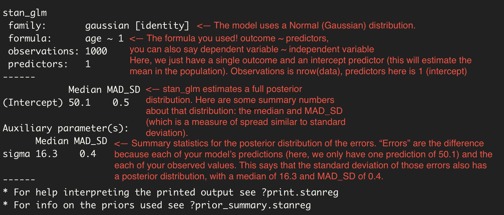

```{r setup, include=FALSE}
knitr::opts_chunk$set(echo = TRUE)
library(rstanarm)
library(PPBDS.data)
library(tidyverse)
```

## Background Info

- If you have a research question (*e.g. what is the influence of school resource officers on student test scores?*), then you have something that you want to estimate. Let's call that something ***H***. 

- If ***H*** were trivial to estimate (*the median height of everyone in this class*) and if you had all of the data that you wanted (*a spreadsheet of everyone's heights in this class*), then this would be very easy - take the median! No uncertainty (or posterior) necessary.

- However, many questions and research projects are more complicated than that. Because of these complications (differences between our sample and our population of interest, missing data, sampling bias, etc.), we often want to show a range of plausible estimates of *H* - this is called a **posterior**.

- You can think about a **posterior** as: based on the evidence that I've seen, what is a reasonable set of values for **H** and how likely are they to be true?

- How can we estimate a posterior? We've learned two techniques so far - using simulations to build a distribution by hand and the bootstrap. Today, we're going to talk about estimating posteriors with a ***Bayesian model***.

## Deciding to fit a model

- We want to use the sample that we have to model the process we are investigating. Often, we use this model to predict outcomes.

- We always have to start by defining our quantity of interest (*H*). For now, let's define *H* to be the average age of adults in the United States. We can't just take a simple average because our dataset, `cces`, does not have all of the data that we want (the heights of all people in the US). Instead, it is a random sample of about 400,000 people.

- An average might seem too simple to be interesting, but don't forget averages are the entire goal of most polling research. What is the proportion of people in the US who plan to vote for Biden? Companies like 538 and the Economist are essentially predicting an "average" in their models.

- This is where *Wisdom* in the book comes in. Should we even make a model? Is this data "close enough" to the population that we want? Are we confident in extrapolating results that we get from this sample onto the full population (all Harvard courses)? There are formal ways to do this, but for now, the two seem pretty close. We have data from nearly half a million people, and maybe we're comfortable with making the assumption this is broadly representative of the US population.

## Our first model

- Now that we've agreed a model is a good fit because our data is a good representation of the population we want, we can think about a model.

- The simplest model we'll talk about in this course estimates the average of a given variable in a population. Soon, we will have both **dependent variables** (outcome) and **independent variables** (predictors). For now, we just have an outcome and an intercept. 

- You can think about models as **predictive** tools. That is, think of your variable on the right hand side as something you are trying to predict given the values on the left. For example, using a school's funding to predict its test scores. 

- This model will estimate the mean of a variable in the population. So, this simple model below predicts age with a constant, fixed number - the mean of the population. Soon, we will include independent variables in these predictions as well. 
- If our sample is a good representation of the population, then we can write:

```{r}
# Take a random sample of 1000 from the cces
# This is just for speed - the cces is huge!

my_survey <- cces %>% 
  sample_n(size = 1000)

# fit a model!

fit_obj <- stan_glm(data = my_survey,     # 1. your data
                    age ~ 1,              # 2. a "formula": age is the outcome, ~ 1 means no predictors
                    family = gaussian(),  # 3. we will use a normal distrbution for this model. why? 
                                          #      because age is roughly normally distributed.
                    refresh = 0)          # 4. this stops a bunch of output from being printed  

fit_obj

# we can use fitted() to get the fitted (i.e. predicted) values for
# each observation if we had relied on the model alone. Here, they are 
# all exactly the same because we are relying only on an intercept - we 
# predict that every observation will have the average age. Not a terrible
# guess, but not that good! We will soon use other variables to improve this
# guess (for example, maybe income or marital status can help to predict age).

fitted(fit_obj)[1:5] # 1:5 just looks at the first 5 values - all 1000 entries are the same!
```

```{r, echo=FALSE, fig.align="center", fig.cap="***How to interpret your stan_glm output.***"}

```

## Accessing the posteriors

- By default, `stan_glm` will return 4,000 draws from each posterior distribution it estimated. Here, it estimated two (one for the mean age, one for sigma), but we only really care about the posterior distribution of age right now.

- To access these draws, turn your model object into a tibble:

```{r}
fit_obj %>% as_tibble()

fit_obj %>% 
  as_tibble() %>% 
  rename(mu = `(Intercept)`) %>% 
  ggplot(aes(x = mu)) +
    geom_histogram(aes(y = after_stat(count/sum(count))), 
                   binwidth = 0.01, 
                   color = "dodgerblue") +
    labs(title = "Posterior Probability Distribution",
         subtitle = "Average age of US adults",
         x = "Age",
         y = "Probability") +
    theme_classic()
```

## Using the posteriors for prediction

- You can also access a posterior distribution for each observation in your dataset by using the `posterior_predict` function and transforming the output into a numeric tibble.

```{r}
post <- posterior_predict(fit_obj) %>%
    as_tibble() %>%
  
    # This line converts every column into a numeric column.
    # The across() function applies a function (as.numeric in this case)
    # to the columns in its first argument (we asked for everything()).
  
    mutate(across(everything(), as.numeric)) 

# dimensions are 4000 rows (draws) x 1000 columns (observations)
dim(post)

# first three observations, 5 posterior predictions for each
post[1:5, 1:3]
```

- Now `post` is a tibble of 4000 rows (the # of draws from our posterior) and 1000 columns (the number of observations in our original data).

- We could use this posterior to estimate distributions to answer other questions we might have. For example, what is the probability that the sum of three random people's ages is greater than 150?

```{r}
# take the first three people as an example
# these column names are awful! could you change them?

tibble(person_1 = post$`1`,
       person_2 = post$`2`,
       person_3 = post$`3`) %>%
  mutate(sum_height = person_1 + person_2 + person_3,
         greater_150 = sum_height > 150) %>%
  summarise(final_prob = mean(greater_150))
```

## Closing Time

- `stan_glm` will help us estimate answers to questions that we're interested in (*H*). To do that, it will estimate a posterior distribution for each term in the model we give it.

- If our sample is an accurate representation of your population, then the posterior returned by `stan_glm()` is probably an accurate posterior distribution of *H*. If not (maybe your sample is biased, or does not really correspond to the question that you want to answer), then your estimated posterior distribution may not be an accurate reflection of the truth.

- The posterior that `stan_glm` calculates would look identical whether we defined our population to be all courses at Harvard or all courses at US colleges (because our model above wouldn't have changed), but how accurate this posterior is to the truth depends on how well your sample maps onto your population and, as a result, *H*. Our model wouldn't change, but how much we believe its results would.

- This is where Temperance comes in. How much faith you place in your model depends on your judgment about how close your data is to your *H*. Using Harvard data, I would have more faith if H is about Harvard courses this semester than I would if H is about US college courses this semester. But I would still build a model because data about Harvard courses are good enough to draw some tentative conclusions about US college courses in general.
